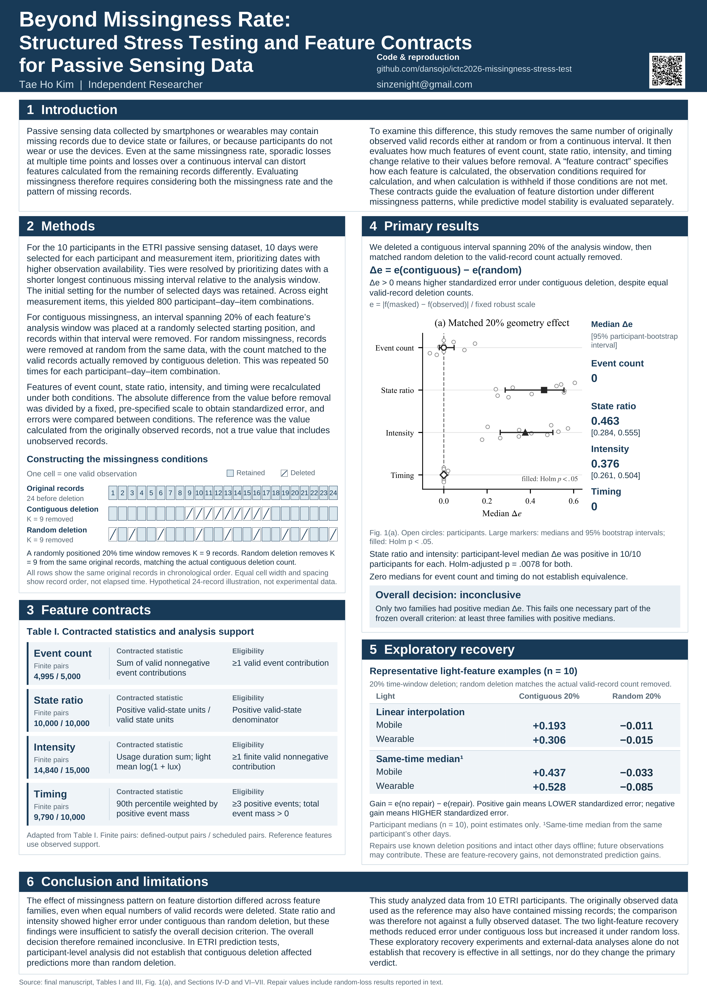

<a name="top"></a>

# Beyond Missingness Rate
## Structured Stress Testing and Feature Contracts for Passive Sensing Data

Reproduction code and a research walkthrough for the manuscript prepared for **ICTC 2026**, by **Tae Ho Kim**. This repository brings together the base passive-sensing pipeline, same-day and other-day reconstruction experiments, external prediction sensitivity, and checks that distinguish fresh computation from archived evidence.

**Research code release.** Data-free tests are available. Full independent raw-to-paper reproduction is not yet established.

Repository: [dansojo/ictc2026-missingness-stress-test](https://github.com/dansojo/ictc2026-missingness-stress-test). Remote: `https://github.com/dansojo/ictc2026-missingness-stress-test.git`. Public research repository. See [reproduction and tests](#reproduction-and-tests) for the validated scope.

**Contents**

- [Research question and results](#research-question-and-results)
- [Quickstart](#quickstart)
- [Repository structure](#repository-structure)
- [Reproduction and tests](#reproduction-and-tests)
- [Verification and limitations](#verification-and-limitations)
- [Citation license and contact](#citation-license-and-contact)

### Poster

<a href="docs/assets/ictc_poster_A0_841x1189mm.pdf"></a>

| Print size | PDF | PNG preview |
|---|---|---|
| A0 · 841 × 1189 mm | [Download PDF](docs/assets/ictc_poster_A0_841x1189mm.pdf) | [View PNG](docs/assets/ictc_poster_A0_841x1189mm.png) |
| 90 × 135 cm | [Download PDF](docs/assets/ictc_poster_custom_900x1350mm.pdf) | [View PNG](docs/assets/ictc_poster_custom_900x1350mm.png) |

Both final posters include the code repository link and QR. Poster materials are separate from the software license.

## Research question and results

**Question:** can two gaps of similar size have different consequences for a passive-sensing feature or a prediction model?

The study tests random deletion against structured blocks and evaluates which feature definitions remain meaningful under those changes. Its contributions are a structured stress-test protocol, explicit feature contracts, and reconstruction and prediction experiments that expose where those contracts hold or fail.

- **Missingness geometry matters:** rate alone does not describe which measurements, timing relationships or behavioral states are removed.
- **Feature contracts make assumptions explicit:** the signal definition, measurement support and analysis window affect whether a damaged feature is usable.
- **Reconstruction and prediction need separate evidence:** recovered feature error does not by itself establish stable downstream predictions.

Selected final-paper values below were checked against archived aggregates at printed precision. They are **not** population results regenerated by the bounded checks in this session.

| Selected metric | Final paper | Archived aggregate |
|---|---:|---:|
| ETRI state-ratio contrast | 0.463 | 0.463349512 |
| ETRI intensity contrast | 0.376 | 0.376368552 |
| StudentLife state / intensity contrast | 0.290 / 0.305 | 0.2904673993 / 0.3050670624 |
| ExtraSensory state / intensity contrast | 0.091 / 0.184 | 0.0912795452 / 0.1838787885 |
| External observed AUROC: StudentLife / ExtraSensory | 0.448 / 0.854 | 0.4484126984 / 0.8538411458 |

The [30-value comparison](docs/verification/paper-targets.csv) and [dated verification record](docs/verification/VERIFICATION.md) retain the numerical sources and scope. Selected agreement does not prove every table, confidence interval or final figure has been reproduced. Bounded recovery agreement and tiny prediction differences must also be kept separate from the known strict-comparison failures below.

## Quickstart

### Environment and installation

Use CPython 3.12; the measured interpreter was **3.12.14**. Run these commands from the repository root. Keep the environment outside the publication tree.

```text
python -m venv ../ictc2026-env
# Windows PowerShell: ../ictc2026-env/Scripts/Activate.ps1
# POSIX: source ../ictc2026-env/bin/activate
python -m pip install --index-url https://pypi.org/simple -r original_paper_reproduction/paper/requirements.txt
```

Activate the environment before subsequent commands. The [requirements file](original_paper_reproduction/paper/requirements.txt) pins the direct dependencies; it is not a full transitive lockfile. Validation used matching existing library installations through an isolated interpreter. **A clean online installation failed in the execution environment and remains unverified. Linux execution is also unverified.**

Keep assertions enabled: do not use `-O`, `-OO`, or `PYTHONOPTIMIZE`.

### First run without research data

```text
python -B scripts/run_tests.py
python -B scripts/verify_release.py
```

Expected output: unittest groups end in `OK`; six private-fixture checks are conditionally skipped when the author fixtures are absent. The distribution checker emits JSON with `"status": "passed"`, `"source_files_checked": 136`, and an empty `issues` list. This is a source/inclusion audit, not a legal clearance or scientific full-reproduction result.

### Inputs for scientific runs

The current launchers additionally require the author's authorized archive, original frozen protocols and private reference artifacts. **Provider downloads alone are insufficient.** No raw data, participant records, donor caches or model states are included.

Follow [data access and placement](docs/DATA.md) and [private configuration](docs/PORTABLE_STAGES.md). Keep the JSON configuration and all outputs outside this repository. The configured `source_roots[].code` entries must identify this checkout's `original_paper_reproduction/` and `extensions/`; do not retain paths to an earlier checkout.

With an existing authorized archive:

```text
python -B scripts/smoke.py imputation_extension --hub "<local-archive>" --limit 1 --output "<private-output>/same-day-01"
```

Expected output: an aggregate `report.json` in that new private output directory, recording the limited scope, verified inputs and comparisons. Input and source hashes are checked before/after; output inside the archive or repository is rejected. Only use trusted pickle inputs from the authorized archive.

[Back to top](#top)

## Repository structure

```text
README.md
.gitignore
original_paper_reproduction/  # base paper pipeline and shared preprocessing
extensions/                  # existing reconstruction and external experiments
scripts/                     # five public CLI entrypoints
  _support/                  # paths, lineage and bounded orchestration
tests/                       # packaging and scientific-contract regression checks
docs/
  assets/                    # final poster PDF/PNG assets and review manifest
  provenance/                # source ledger and release-relative checksums
  verification/              # measured results and paper-value comparison
```

| Location | Contents and purpose |
|---|---|
| `original_paper_reproduction/paper/` | Base ETRI, downstream and external feature pipeline |
| `original_paper_reproduction/leaderboard/` | Shared preprocessing required by the paper pipeline |
| `extensions/2026-09-10/reviewer_extension/` | M0 and legacy recovery support |
| `extensions/2026-09-11/imputation_extension/` | Same-day reconstruction |
| `extensions/2026-09-11/crossday_imputation_v1/` | Other-day reconstruction and donor inventory |
| `extensions/2026-09-11/external_inventory/` | External inventory and prepared-window canonicalization |
| `extensions/2026-09-11/external_prediction/` | External LOSO prediction and paired masks |
| `scripts/` | `run_tests.py`, `verify_release.py`, `smoke.py`, `portable_run.py`, `fresh_chain.py` |
| `tests/` and `docs/` | Regression checks, data guidance, provenance and measured limitations |

The research trees keep their existing internal structure. The standalone `posters/` directory has been consolidated into `docs/assets/`. Previous root commands now use a `scripts/` prefix; arguments are unchanged. See [layout and migration](docs/LAYOUT.md). Root-level compatibility wrappers are intentionally absent so the root remains focused on the README.

## Reproduction and tests

### Choose the scope

| Module or check | Command from repository root | Inputs and result |
|---|---|---|
| Public tests | `python -B scripts/run_tests.py` | Synthetic/public fixtures; unittest results |
| Distribution audit | `python -B scripts/verify_release.py` | Packaged sources/assets; audit JSON |
| Base input gate | `python -B scripts/portable_run.py check base --config "<private-paths.json>"` | Configured roots and pinned original inputs; no model fitting |
| Same-day smoke | `python -B scripts/smoke.py imputation_extension --hub "<local-archive>" --limit 1 --output "<private-output>/same-day-01"` | Archived masks/references; new bounded recovery comparisons |
| Other-day smoke | `python -B scripts/smoke.py crossday_imputation_v1 --hub "<local-archive>" --limit 1 --output "<private-output>/cross-day-01"` | Archived masks/donors; new bounded recovery comparisons |
| External prediction smoke | `python -B scripts/smoke.py external_prediction --hub "<local-archive>" --limit 1 --output "<private-output>/external-01"` | Prepared windows; two fresh LOSO fits and paired-mask comparisons |

Recovery limits select up to five primitive cells and retain the original draws. External `--limit 1` means one held-out participant **per dataset**, yielding two new fits; all outer-training windows are retained. Use a different new output directory for each run.

The supported stage names and configuration are documented in [portable stages](docs/PORTABLE_STAGES.md). Keep outputs private: some stage outputs contain participant-level records.

### Bounded raw-to-recovery route

```text
python -B scripts/fresh_chain.py --config "<private-paths.json>" --output "<private-output>/fresh-chain-01" --cells 5
```

This connects nine bounded stages with raw inputs, full-population selection/scales and complete donor dates for selected partitions. It checks actual generated parents independently of historical freezes. See [fresh-chain scope](docs/FRESH_CHAIN.md). It is not the complete paper run.

### Full study and private fixtures

The full entrypoint remains available, but the approximately 11-hour run is **on hold and was not executed for this layout change**:

```text
python -B scripts/portable_run.py run base --config "<private-paths.json>" --output "<private-output>/base-full-01"
```

Review [the full-run plan](docs/FULL_RUN_PLAN.md) before execution. Never rewrite frozen protocol hashes to bypass an input gate. [Private-fixture documentation](docs/SKIPPED_TESTS.md) distinguishes the six additional fixture tests from the public suite.

ETRI block loss is defined by time-window length; its paired random deletion removes the same valid-record count. External prediction uses `K=floor(0.2n)` valid records. The definitions and original seeds remain distinct. The final manuscript's Figure 1 is inline TikZ; the old base renderer's `fig2_results` is not an equivalent final-figure reproduction.

[Back to top](#top)

## Verification and limitations

The existing [October 4 layout recheck](docs/verification/LAYOUT_RECHECK_20261004.md), using CPython 3.12.14 on Windows with matching preinstalled dependencies attached through an isolated interpreter, recorded 238 public tests with six conditional skips, plus six separate private fixtures. The six public skips require private archived fixtures that are absent or unconfigured. These are dated historical results. See [the October 5 publication check](docs/verification/PUBLICATION_CHECK_20261005.md) for the new public checks. It also reran three bounded experiment paths and canonicalization. Dated evidence is in [the verification report](docs/verification/VERIFICATION.md), [structured results](docs/verification/verification.json), and [the October 3 recheck](docs/RECHECK_20261003.md). These records describe their own snapshots; they are not claims that every experiment was rerun after a folder change.

- The archived-paper audit matched **30 selected values** at printed precision.
- Earlier bounded same-day/cross-day computations matched **5,000 / 4,000 recovery rows** exactly.
- The earlier nine-stage raw chain completed, but the all-column preparation exact comparison remained **false**, with maximum difference **1.7763568394002505e-15**.
- The historical Brier strict comparison remains **false / exit 2**. No tolerance or freeze was relaxed to present it as a pass.
- External prediction's bounded probability comparison had maximum difference **2.220446049250313e-16** under its unchanged diagnostic tolerance. This is separate from strict equality.
- External inventory rebuilding is blocked by two original UCSD ExtraSensory provenance files: `cv5Folds.zip` and the provider `README.txt`. See [provenance and required files](docs/EXTERNAL_PREREQUISITES.md). Nothing was downloaded or substituted.
- Clean installation, Linux execution, full downstream fits and full raw-to-paper reproduction remain unverified.
- Final A0 and 90 × 135 cm poster files and README links were verified on October 5, 2026. The code license is undecided.

[Back to top](#top)

## Code provenance

The research code was authored by Tae Ho Kim. The directories named vendor, full_vendor and g2_vendor preserve historical snapshots of this research project. No incorporated third-party source code was identified in the source review; separately installed dependencies retain their own licenses. See [provenance](docs/PROVENANCE.md).

## Citation license and contact

The supplied manuscript identifies **Tae Ho Kim** as author. Use the [provisional citation](docs/CITATION.md) until publication metadata is verified. No DOI, proceedings pages, published code commit or release tag is invented. The author-supplied repository URL is recorded above.

A code license has not been selected; no license grant is implied. See [license status](docs/LICENSE_STATUS.md). Dataset access terms are separate and must be respected.

Contact: Tae Ho Kim. A public contact link will be added when confirmed; none is assumed here. The [Korean upload checklist](docs/UPLOAD_CHECKLIST_KO.md) records the remaining publication decisions.

[Back to top](#top)

